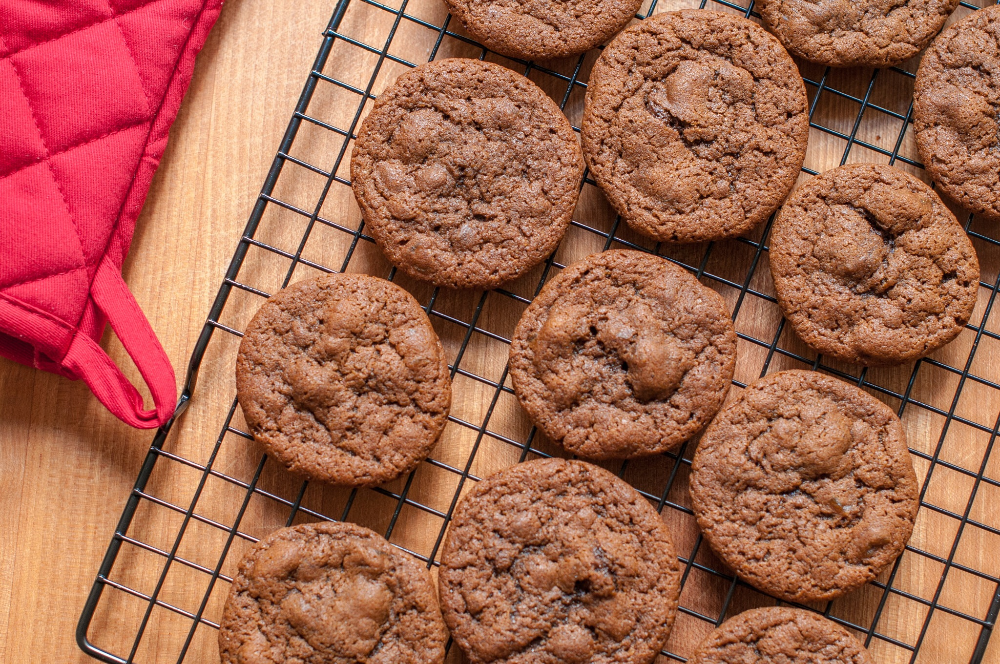
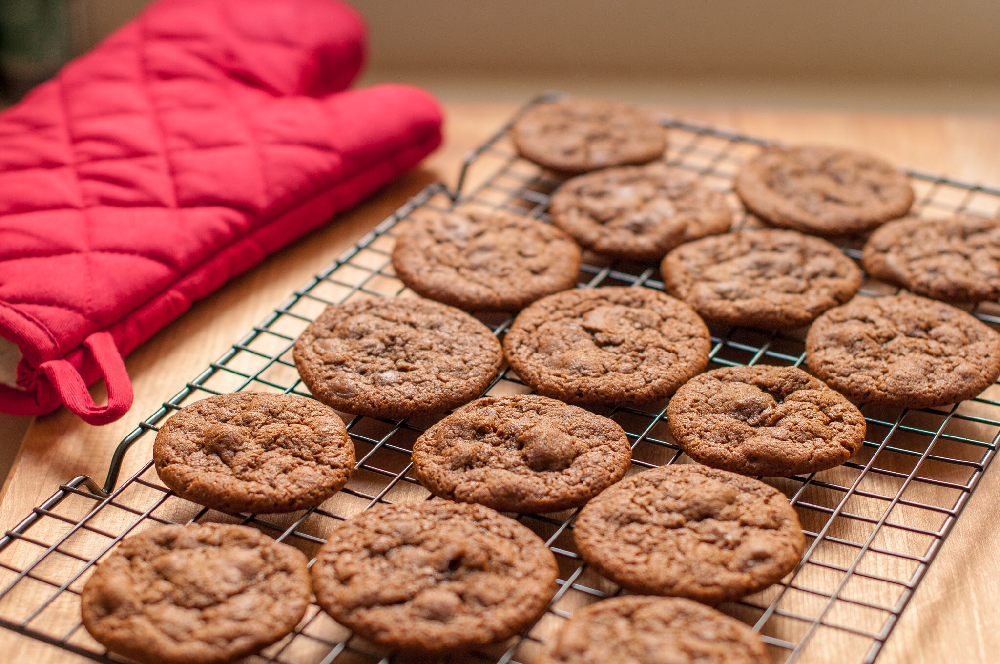
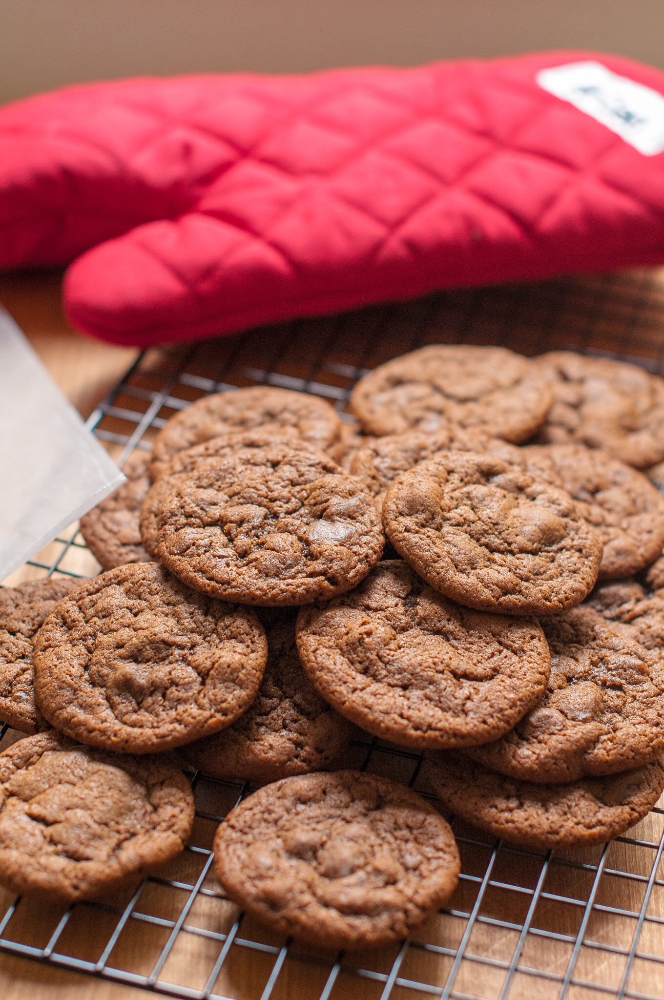

# Alton Brown's Ginger Snaps Cookies

## Ingredients

- [ ] 9 1/2 ounces all-purpose flour
- [ ] 1 1/2 teaspoons baking soda
- [ ] 1 tablespoon ground ginger
- [ ] 1/2 teaspoon ground cardamom
- [ ] 1/2 teaspoon ground cloves
- [ ] 1/2 teaspoon kosher salt
- [ ] 7 ounces dark brown sugar
- [ ] 5 ounces unsalted butter (at room temperature)
- [ ] 3 ounces molasses (by weight)
- [ ] 1 large egg (at room temperature)
- [ ] 2 teaspoons fresh ginger (finely grated)
- [ ] 4 ounces candied ginger (finely chopped)

Modifications for a less sweet more cake-like cookie:

- [ ] 10 1/2 ounces all-purpose flour
- [ ] 6 ounces dark brown sugar
- [ ] 4 ounces candied ginger (some finely chopped, some chunky)

## Directions

1. Heat the oven to 350° F.
2. Whisk together the flour, baking soda, ground ginger, cardamom, cloves and salt in a medium mixing bowl.
3. Cream the brown sugar and butter in a stand mixer fitted with the paddle attachment and beat on low speed until light and fluffy, 1 to 2 minutes. Add the molasses, egg and fresh ginger and beat on medium speed for 1 minute. Add the candied ginger and using a rubber spatula, stir to combine. Add the dry ingredients to the wet and stir until well combined.
4. Using a 2-teaspoon-sized scoop, drop the dough onto a half sheet pan lined with parchment paper, approximately 2 inches apart. Bake on the middle rack of the oven for 12 minutes for slightly chewy cookies or 15 minutes for crisper cookies, rotating the pan halfway through baking.
5. Remove from the oven and leave the cookies on the sheet pan for 30 seconds before transferring to a cooling rack to cool completely. Repeat with all of the dough. Store in an airtight container for up to 10 days. If desired, you may scoop and freeze the cookie dough on a sheet pan and, once frozen, transfer to a zip-top bag to store. Bake directly from the freezer.

## Photos

