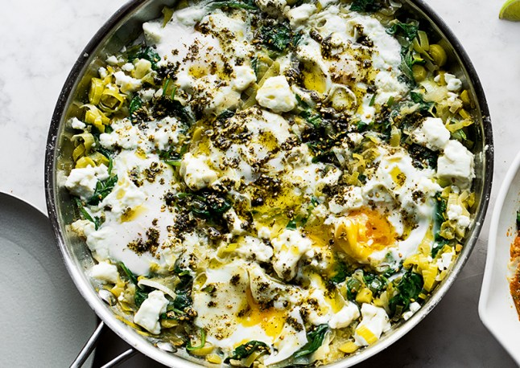

# Green Shakshuka

Ingredients

- [ ]  30g unsalted butter
- [ ]  2 tbsp olive oil
- [ ]  2 large leeks (or 4 smaller), trimmed and cut into ½ cm slices (530g)
- [ ]  1 tsp cumin seeds, toasted and lightly crushed
- [ ]  2 small preserved lemons, pips discarded, skin and flesh finely chopped (30g)
- [ ]  300ml vegetable stock
- [ ]  200g baby spinach leaves
- [ ]  6 large eggs
- [ ]  90g feta, broken into 2cm pieces
- [ ]  1 tbsp za'atar
- [ ]  salt and black pepper

This is a quick way to get a very comforting meal on the table in a wonderfully short amount of time. It’s a dish as happily eaten for brunch, with coffee, as it is for a light supper with some crusty white bread and a glass of wine. The leeks and spinach can be made up to a day ahead and kept in the fridge, ready for the eggs to be cracked in and braised.

1. Put the butter and 1 tablespoon of oil into a large sauté pan, for which you have a lid, and place on a medium high heat. Once the butter starts to foam, add the leeks, ½ teaspoon of salt and plenty of pepper. Fry for 3 minutes, stirring frequently, until the leeks are soft. Add the cumin, lemon and vegetable stock and boil rapidly for 4–5 minutes, until most of the stock has evaporated. Fold in the spinach and cook for a minute, until wilted, then reduce the heat to medium.
2. Use a large spoon to make 6 indentations in the mixture and break one egg into each space. Sprinkle the eggs with a pinch of salt, dot the feta around the eggs, then cover the pan. Simmer for 4–5 minutes, until the egg whites are cooked but the yolks are still runny.
3. Mix the za'atar with the remaining tablespoon of oil and brush over the eggs. Serve at once, straight from the pan.

